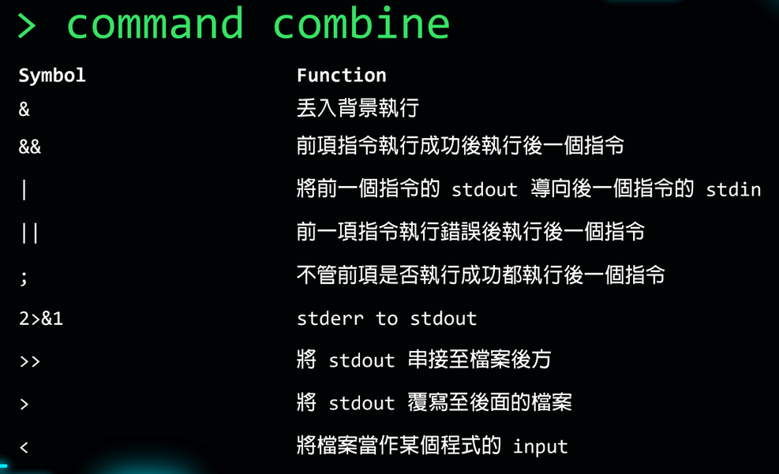
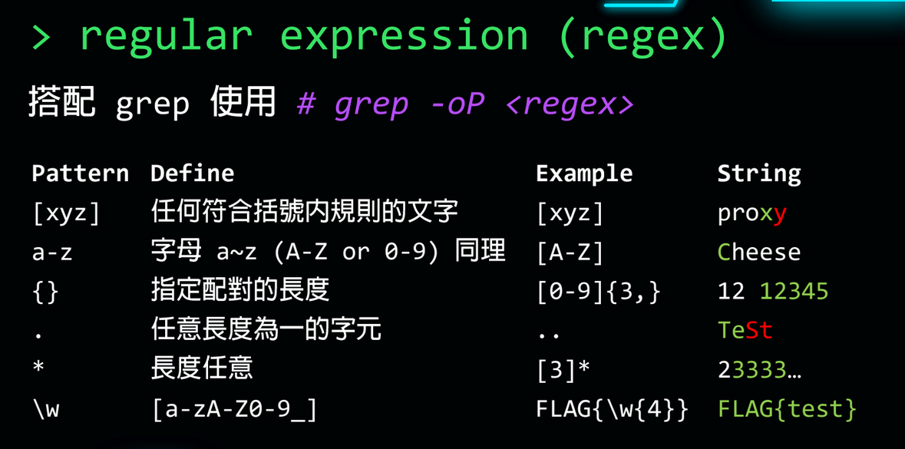
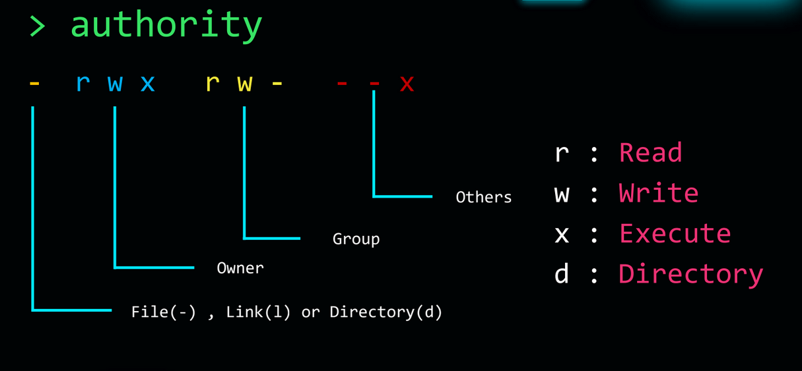

- apt 
  collapsed:: true
  套件管理工具
	- update 更新
- cat 
  讀取檔內容
- cd <路徑>
  移至<路徑>
	- ./表示當前的資料夾
	- ../ 表示回到上一層
- chmod <權限> <路徑>
  collapsed:: true
  修改權限
	- <權限> 可使用二進位表示或+ -
		- [u、g、o]可用於+ -，分別為[當前使用者、當前群組、其它群組]
	- <路徑> 
	  執行檔案
		- 當前的資料夾內的檔案需加上./
- clear 
  collapsed:: true
  清除終端機
	- Ctrl + L 有一樣的效果，但不會清除，只會將訊息推至上方
- cp <路徑1> <路徑2>
  複製檔案
- echo
  輸出
	- 加上 > 寫至檔案(原內容會被清空)
	  如不要清空則使用 >>
	- -n 不換行
	- 特殊字元
		- {:height 273, :width 433}
		- * 為萬用字串
		- ? 為萬用字元
- file <路徑>
  檢查檔案類型
- find -name <名稱>
  collapsed:: true
  尋找檔案
	- -type d 只搜尋資料夾
- grep <字串> <檔案>
  檢查字串是否存在特定字串
	- -i 忽略大小寫
	- -o 僅輸出符合的字串
	- -p <字串> 為正則表達式模式
	- {:height 219, :width 427}
- history
  查看指令紀錄
- ls <路徑> 
  collapsed:: true
  顯示資料夾的內容
	- 不加路徑表示當前資料夾
	- -a 顯示所有檔案(含隱藏)
	- -al 顯示所有檔案(含隱藏、詳細資料)
		- 檔案或資料夾有authority訊息
		- {:height 272, :width 472}
		- rwx可轉成二進制表示
- man --help
  collapsed:: true
  手冊
	- <指令> --help
- mkdir <相對路徑>
  collapsed:: true
  開新資料夾
	- -p 才能包含完整的路徑，則只能新增單一層級
- mv <路徑1> <路徑2>
  collapsed:: true
  移動或改名
	- 改名只要設為同路徑即可
- touch <名稱>
  開新檔案
- rm
  collapsed:: true
  移除檔案
	- -r 移除資料夾
	- -f 強制移除
- strings <路徑>
  讀取連續4個可視字元
	- -n 指定字元數
	- 可和grep一起使用在檔案中找特定的字串
		- strings <檔案> | grep <字串>
- ssh <帳號>@<IP>
	- -p 指定port
- sudo <指令>
  collapsed:: true
  使用管理員執行
	- su 直接切到管理員模式
- unzip <路徑>
  zip解壓縮
- whoami
  查前當前群組